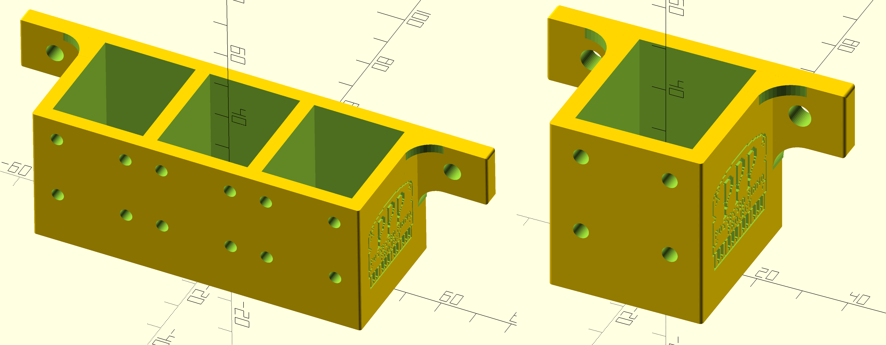

# Poltergeist Piano Project

## Overview

## Bill of Materials (BOM)

- [Adafruit Feather Huzzah, ESP8266](https://www.adafruit.com/product/2821)
    - A similar microcontroller can be used. I just happen to have a ton of these on hand because they're versatile and relatively cheap. This one happens to have a WiFi chip on board, but it's entirely dormant for this project.
- [128x64 OLED screen for Feather](https://www.adafruit.com/product/4650)
    - 100% optional. I like it because it gives me a status display and three buttons that can be used for testing.
- [12V Solenoid](https://www.adafruit.com/product/413) × 4
- [IR Distance Sensor](https://www.adafruit.com/product/1031)
- [Neopixel Strip](https://www.adafruit.com/product/1460), about 53 inches to span the piano
- TIP120 Darlington Transistors × 4
- 1N4004 Diodes × 4
- 1K Ω Resistors × 4
- [7805 5V Linear Voltage Regulator](https://www.adafruit.com/product/2164)
- 12VDC power supply and inline power switch.
- Assorted miscellanea. Wires, solder, heat-shrink tubing, terminal blocks, etc.

## Schematic

The [schematic (pdf link)](schematic.pdf) is fairly straightforward. The [KiCad](https://www.kicad.org) source lives in [the KiCad project folder](../KiCad/). Each of the solenoids is a copy/paste job, joining together a power transistor, resistor, diode, and the solenoid. The Neopixel is wired to a binary data pin. The distance sensor is wired to the one and only ADC pin.

It's worth noting that the pin number that KiCan assigns to the Feather Huzzah microcontroller are not intuitive. They don't match the pin numbers silk-screened onto the board. Nor do they match the internal pin numbers of the ESP8266:

The numbers in KiCad, instead, count around the outside of the board, treating it like a regular IC chip. For example, looking at the above pinout, KiCad labels “pin 1” as the reset, “pin 2” is the 3.3V line, “pin 3” is the not-connected pin, etc.

## Main-Board Assembly

This is a custom layout on a protoboard.

That protoboard is then attached to a wood backboard that can be mounted. It interfaces with all the remote devices and sensor through screw-down terminal blocks. The lase file for the wood backboard is in [the Laser project folder](../Laser/).

Both the Feather microcontroller and the OLED carrier board are attached via pin socket. Either/or can be easily replaced without needing to solder.

## Device/Sensor Assembly

- The solenoids are basic — there are two wires and, because they are simply electromagnetic coils, they are not polarized. They are physically labeled on the solenoid, the hookup wire, and the terminal blocks (as well as in code) 1..4:
    - Solenoid 1: low note
    - Solenoid 2: lower note
    - Solenoid 3: lowest note
    - Solenoid 4: high trill/stinger
- The Neeopixel strip has power, ground, and a data line.
- The proximity/distance sensor has power, ground, and an analog sense line.
- The power plug supplies 12VDC to the mainboard, which gets divided into a 12VDC rail and a 5VDC rail.

All are wired into the labeled terminal blocks. The terminal blocks for the solenoids, on the mainboard side, have protective diodes screwed in along side the hookup wires.

The solenoids are mounted into 3D-printed brackets. These are printed in ABS (the same plastic as LEGO bricks) for strength. They are attached by 6mm M3 metric screws. The bracket files can be found in [the Brackets project folder](../Brackets/).

_(The above two solenoid images are not to scale between each other. Every cubbyhole is for the same size solenoid.)_

The power plug mount is also printed in ABS and lives in that same folder.

## Test Code

There are assorted test/bringup code projects in [the Bringup project folder](../Bringup/). These were used during hardware development and assembly to test out individual circuits and components.

## Production Code

### IDE Setup / Prerequisites

Code is compiled and uploaded through the Arduino IDE. [This can be downloaded from the Arduino site](https://www.arduino.cc/en/software) for Windows, macOS, or Linux. Once the IDE is installed, you'll have to launch it and use its features to install the dependencies required for the microcontroller, display, and LED strip. Adafruit has great guides for installation:

- [Feather Huzzah ESP 8266 toolchain](https://learn.adafruit.com/adafruit-feather-huzzah-esp8266/using-arduino-ide)
- [OLED board library](https://learn.adafruit.com/adafruit-128x64-oled-featherwing/arduino-code)
- [Neopixel library](https://learn.adafruit.com/adafruit-neopixel-uberguide/arduino-library-installation)

New code is uploaded through the micro USB port on the Feather board (it's the board behind the board carrying the OLED screen). Connecting can be a little tight because of the mounting screw for the white protoboard. But there's some give here because the microcontroller is in a socket and can be lifted up slightly.

### The Code

(TBD)

## Bugs

At power-up, there appears to be a power spike on the Solenoid 1 pin. This appears to be some state the mictrocontroller gets into before any user code is executed. This makes it tough to fix without a big redesign of the circuit. Practically speaking, this means that when powering up the mainboard, one of the low notes gets briefly hit.
